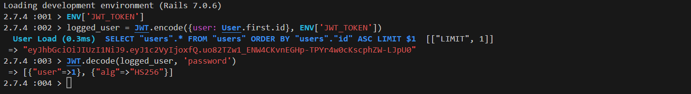
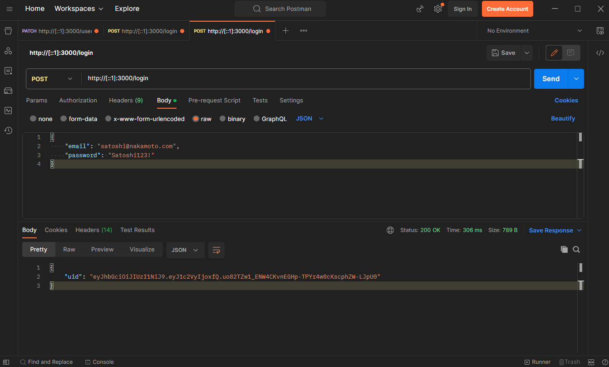
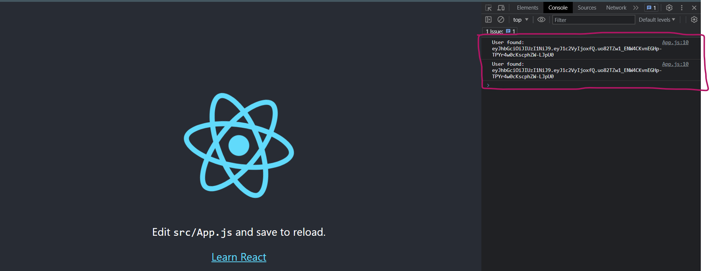

# JWT_project

Hello and welcome to JWT_project. This small app was built to be somewhat of a sanity check (and deep-dive that I could blog about) when refactoring a larger full stack application, [Burger Buddy](https://burgerbuddy.onrender.com/), from cookies-based authentication to JWT-based authentication. Auto-login functionality is also implemented. 

This app serves as the foundation for a series of [blog posts that begin here](https://medium.com/@wrosullivan88/backend-authentication-and-encryption-using-rails-bcrypt-jwt-react-localstorage-and-react-401c472d762b). Since this blog post is quite lengthy, I will be keeping the README short - everything concerning versions, dependencies, etc. is covered in the linked blog post above. 

If user authentication is a topic that interests you, check out my [recent blog post](https://medium.com/@wrosullivan88/auth0-implementation-in-a-rails-react-app-91a70a80a735) covering Auth0/SSO implementation. You can find the [repo for Auth0_project here](https://github.com/ryanosull/Auth0_project).

# Screenshots

# Features

JWT_project simplifies user authentication using JSON Web Tokens (JWT). Furthermore, JWT_project includes an automatic login feature. This functionality deciphers an authentication token (`auth_token`) using JWT, decodes the user ID from it, and subsequently queries for a corresponding User record. When a user is discovered, their ID is rendered in JSON format with an HTTP status code of 200. However, if the auth_token is missing, `nil`, `false`, or is the string `undefined`, the system invokes the `cannot_login` method.

# Usage

JWT_project is currently hooked up to a PostgreSQL database. In the future, I may refactor for use with SQLite. As such, never mind running locally - just read the blog. 

### Enjoy!